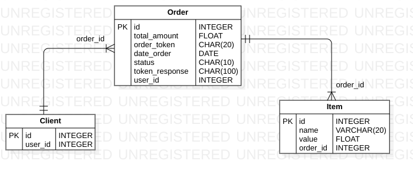
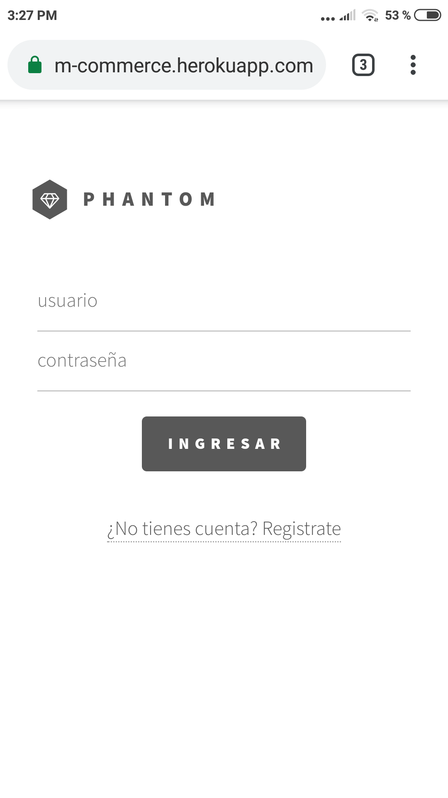
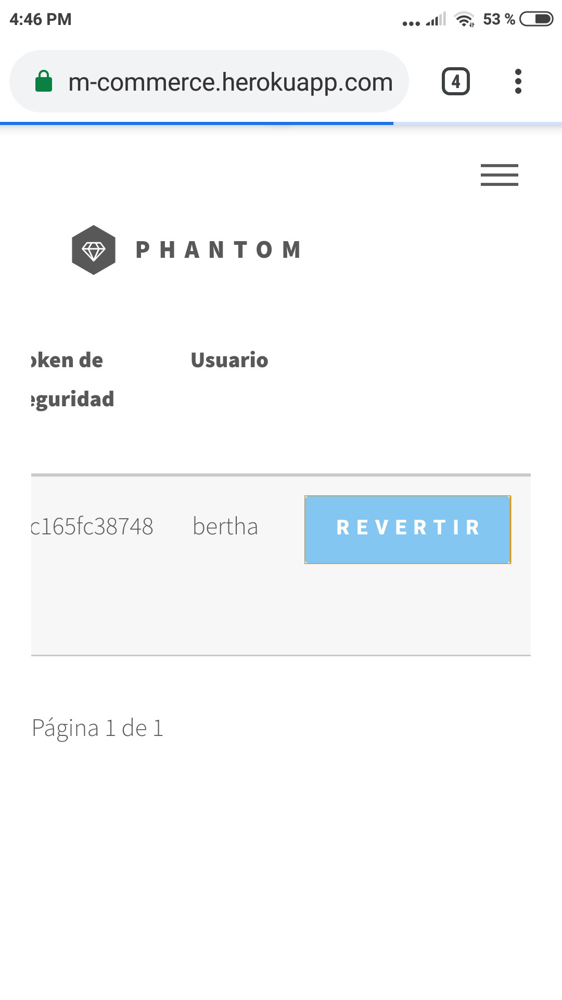
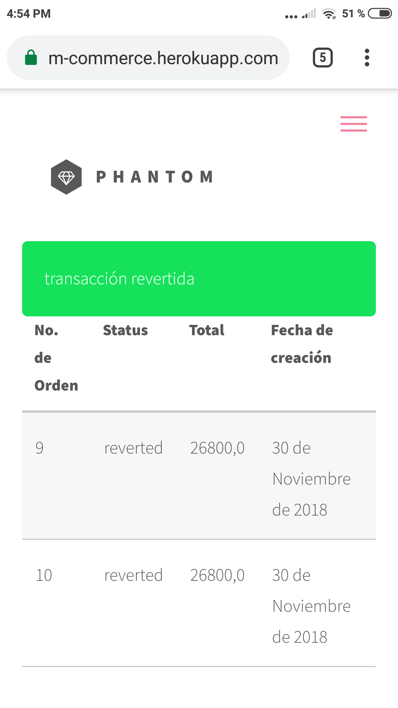

# Descripción Comercio

Phanton commerce es un comercio qué funciona como aplicación web. la cual se comunica con la Tpaga API para realizar transacciones con sus productos. La aplicación está concebida como un proyecto Django, conformada por tres aplicaciones: usuarios, pagos y productos. La aplicación de pagos es la que se comunica con la Tpaga API para realizar transacciones sobre una orden creada en específico.

### Modelo de BD

#### Creación de Modulos

El proyecto está concebido como un proyeto de Django. El proyecto está conformado por tres aplicaciónes: usuarios, pagos y productos. El modulo de pagos se comunica con la API de Tpaga para realizar las operaciones que tienen que ver con la creación, modificación y eliminación de ordenes generadas por los usuarios de la aplicación web. Realmente, la implementación de los modulos me llevó aproximadamente unas **10 horas** sumando todos los instantes en los que trabajé en ellos. Podría decirse que esta parte de la implementación, la desarrollé a manera incremental a medida que se me iban ocurriendo cosas,cómo poder registrar usuarios y qué cada usuario tuviera varias ordenes asociadas a el mismo. Cambios cómo ese también significan cambios en el modelo de la Base de Datos de la aplicación. 

#### Escribiendo las vistas

Las vistas en Django, permiten la gestión de los datos en el proyecto para posteriormente poder visualizarlos en las plantillas. El trabajo con las vistas, fue relativamente sencillo gracias a las capacidades con las qué cuenta Django. Tal vez lo más complicado de este punto, fue lograr armar y entregar los datos de manera qué en las plantillas fuera sencillo mostrar y entender los datos por parte del usuario final de la aplicación web. Muy relacionado con el tema de los modulos, el timpo total de implemtación de las vista fue apróximadamente entre **8 y 10 horas**, teniendo en cuenta qué practicamente el tiempo de implementación de los modulos coincide con el de las vistas de cada aplicación, entendiendo por aplicación los modulos qué conforman el proyecto de la aplicación web. 

#### Implementación de registro y autenticación de usuarios

Como parte de los modulos que conforman el proyecto, quise implementar la posibilidad de qué un usuario se registrará en la aplicación, y de esta forma poder tener control sobre las ordenes y el usuario al qué pertenecen. A nivel de base de datos, un usuario puede generar muchas ordenes. En está implementación, trabajé aproximadamente entre unas **3 y 4 horas**. 

#### Realizando pruebas en Heroku 

El despliegue en Heroku fue de las actividades más complicadas, ya qué poca es la experiencia sobre el tema. Anteriormente había hecho un despliegue utilizando heroku, pero este se me hacía más complicado, dado qué en este caso hago uso de archivos estáticos como las plantillas, las hojas de estilos, etc. Además de la subida de archivos y condiguraciones del proyecto, el despliegue también implíca las pruebas que se realicen, por ejemplo, en muchas ocaciones mis vistas retornaban errores propios de Django qué debía solucionar para seguir con las pruebas, lo que implíca solucionar, actualizar el git y agregar los cambios a la rama remota qué gestiona el despliegue en Heroku. En este item, trabajé aproximadamente unas **3 horas** a la espera del tiempo adicional qué invierta en las ultimas pruebas antes de enviar esto. 

### Revertir Transacciones

Para revertir una transacción, se deben ingresar con:
 - usuario : manager
 - contraseña : commerce123

 

 Una vez dentro se despliega la siguiente interfaz

 En el momento en qué se da clic en revertir, la aplicación envía una solicitud a la Tpaga API. La respuesta de la operación se ve reflejada así:

 

#### Para realizar pruebas con Docker,ejecutar los siguientes comandos :
1. git clone https://github.com/jsparadacelis/mini-commerce.git
2. cd mini-commerce
3. sudo docker-compose up
4. Entrar a http://127.0.0.1:8000/ desde el navegador

¡ Y listo !
